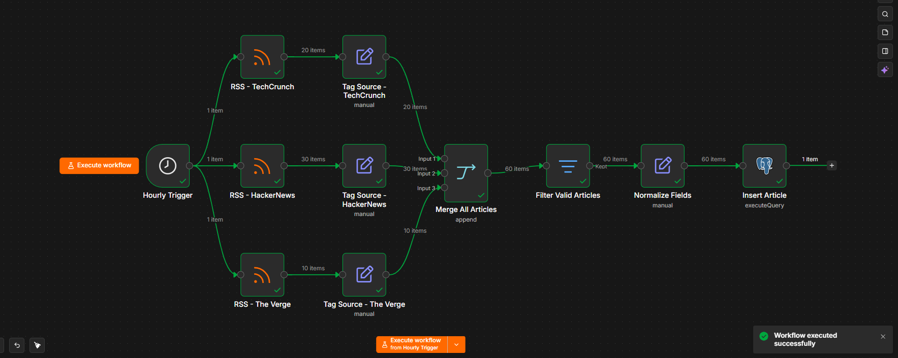
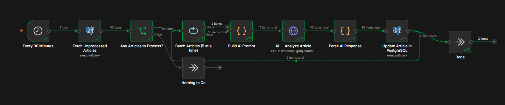
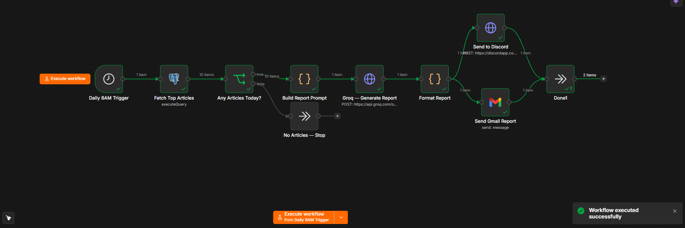
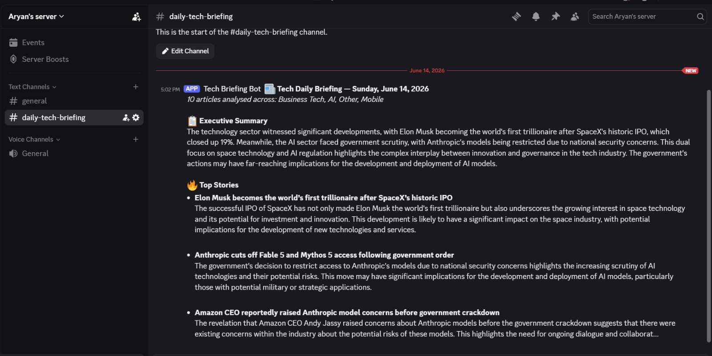
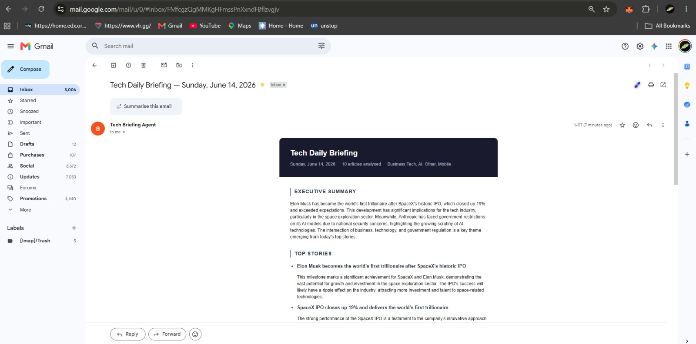

# 📰 Tech News Research Agent

An automated pipeline that collects tech news, categorises and scores articles with AI, and delivers a professional daily briefing — every morning at 8 AM.

---

## How It Works

```
RSS Feeds → PostgreSQL → AI Analysis → Daily Report → Discord + Gmail
```

Three n8n workflows run in sequence:

| Workflow | Schedule | What it does |
|---|---|---|
| **WF-01 · News Collector** | Every hour | Pulls articles from TechCrunch, HackerNews, The Verge → stores in PostgreSQL |
| **WF-02 · AI Processor** | Every 30 min | Categorises, summarises, and scores each article via Groq (Llama 3.3 70B) |
| **WF-03 · Daily Report** | 8 AM daily | Selects top articles → generates briefing → sends to Discord & Gmail |

---

## Workflow Diagrams

### WF-01 · News Collector


### WF-02 · AI Processor


### WF-03 · Daily Report Generator


---

## Output Previews

### Discord — Daily Briefing


### Gmail — HTML Email Report


---

## Stack

- **n8n** — workflow orchestration
- **PostgreSQL** — article storage
- **Groq API** — Llama 3.3 70B for AI analysis
- **Discord Webhook** — briefing delivery
- **Gmail OAuth2** — email delivery

---

## Database Schema

```sql
CREATE TABLE articles (
  id             SERIAL PRIMARY KEY,
  title          TEXT,
  url            TEXT UNIQUE,
  source_name    TEXT,
  author         TEXT,
  published_at   TEXT,
  content        TEXT,
  category       TEXT,
  summary        TEXT,
  importance_score INTEGER,
  processed      BOOLEAN DEFAULT false,
  created_at     TIMESTAMPTZ DEFAULT NOW()
);
```

---

## Setup

1. Import all three workflow JSON files into n8n
2. Connect your **PostgreSQL** credential (used across all workflows)
3. Add your **Groq API key** as an HTTP Header Auth credential
4. Create a **Discord webhook** and paste the URL into WF-03
5. Connect **Gmail OAuth2** in WF-03
6. Activate workflows in order: WF-01 → WF-02 → WF-03

---

## AI Categories

`AI` · `Startups` · `Cybersecurity` · `Cloud` · `Software Engineering` · `Mobile` · `Data Science` · `Business Tech` · `Other`

Importance scored **1–10** per article. Daily report selects the top 10 by score.

---

*Built with n8n · Powered by Groq*
